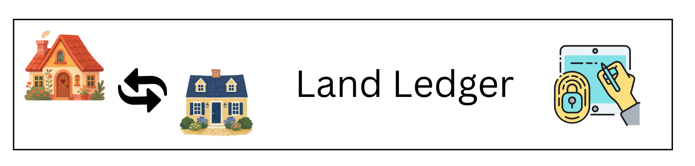
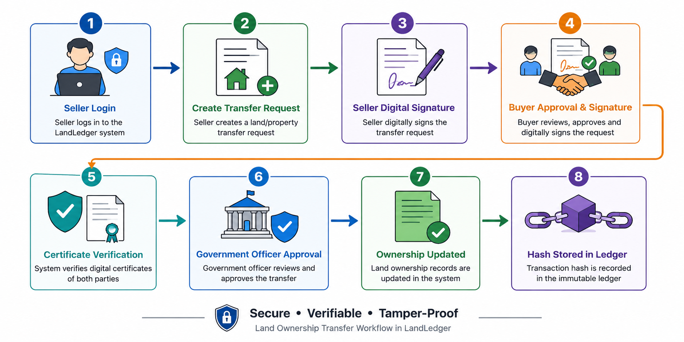

---

<div align="center">



### PKI-Based Land Ownership Transfer System

A secure web application that uses **Public Key Infrastructure (PKI)** to make land ownership transfers verifiable, tamper-proof, and digitally signed.

<br>


  
  
  
</div>


## Cryptography

<p align="center">
  
  
  
  
  
</p>

## Project Type

<p align="center">
  
  
  
  
  
</p>

## Identity & Access

<p align="center">
  
  
  
  
  
</p>

## Status

<p align="center">
  
  
  
  
</p>

## Security Foundation

<p align="center">
  
  
  
  
  
</p>

---

## What is LandLedger?
LandLedger demonstrates a complete digital land ownership verification and property transfer path:

- A user registers with their National ID (NID) or PAN card - the system validates their identity, name, and biographic details against the citizen database before allowing account creation.
- Upon successful identity verification, the LandLedger Certificate Authority automatically issues a personal X.509 certificate bound to the user's RSA-2048 key pair.
- A land owner registers their property - the system computes a SHA-256 hash of the property details, creating a tamper-proof cryptographic fingerprint stored permanently in the database.
- When a transfer is initiated, the seller digitally signs the deed document using their RSA private key, producing a PKCS1v15 signature that proves consent and authenticity.
- The buyer counter-signs the same deed with their own private key, creating a dual-signature binding that proves both parties agreed to the exact same terms.
- A Government Officer reviews the transfer and runs a full six-check verification - seller NID status, buyer NID status, seller X.509 certificate validity, buyer X.509 certificate validity, seller digital signature, and buyer digital signature - and approves only if all six pass.
- Upon approval, a new block is added to the immutable hash-chained ledger. Each block contains the deed hash, transfer details, and the hash of the previous block - making any tampering with historical records cryptographically detectable.
- Ownership is updated in the database and anyone can independently verify any deed by entering its SHA-256 hash - the system returns certificate validity, signature validity, and ledger inclusion status without requiring login.
- An admin panel provides full user lifecycle management - activating, deactivating, and auditing all accounts - while a transfer activity log gives government officers a clean view of all property movement events.

## Core Features

- Seller, Buyer, and Government Officer registration
- NID / PAN verification
- X.509 certificate generation
- Digital signature for land transfer
- Ownership transfer approval system
- SHA-256 ledger hash chain
- Audit log for every action

---

## How LandLedger Works

Flowchart
<div align="center">

</div> 

## Installation & Setup
```bash
# 1. Install dependencies
pip install -r requirements.txt

# 2. Run
python app.py

# 3. Open browser
http://127.0.0.1:5000
```

---

## Demo Walkthrough

### Step 1 - Register 3 accounts:
| Role | Email (example) | Password |
|------|----------------|----------|
| Land Owner (Seller) | seller@demo.com | test123 |
| Buyer | buyer@demo.com | test123 |
| Govt Officer | officer@demo.com | test123 |

### Step 2 - As Seller:
- Login → Dashboard → **Add Property**
- Fill in property details → SHA-256 hash is generated

### Step 3 - As Seller:
- Dashboard → **Transfer Property**
- Select property, enter buyer@demo.com
- System signs deed hash with seller's RSA key

### Step 4 - As Buyer:
- Login → Dashboard → **Sign Deed**
- Buyer counter-signs with their RSA key

### Step 5 - As Govt Officer:
- Login → Dashboard → **Verify & Approve**
- System verifies ALL signatures + X.509 certs
- Block is added to immutable ledger

### Step 6 - Verify:
- Go to /verify → paste deed hash → all green ✅

---

## Cryptography Used

| Concept | Implementation |
|---------|---------------|
| Certificate Authority | LandLedger CA (self-signed X.509) |
| User Certificates | X.509 v3, signed by CA |
| Key Algorithm | RSA-2048 |
| Signature Algorithm | RSA + SHA-256 (PKCS1v15) |
| Hash Function | SHA-256 (deed hash, block hash, property hash) |
| Blockchain | SHA-256 hash chaining |
| Storage | SQLite (dev) |
| Transport | Flask dev server (use HTTPS in production) |

---

## Project Structure

```
landledger/
├── app.py                 # Flask entry point
├── requirements.txt
├── pki/
│   └── ca.py             # LandLedger CA (X.509, RSA, signing)
├── database/
│   └── db.py             # SQLite schema & connection
├── routes/
│   ├── auth.py           # Register, login, logout
│   └── main.py           # Dashboard, property, transfer, ledger, verify
├── templates/            # Jinja2 HTML templates
├── static/
│   ├── css/main.css
│   └── js/main.js
└── certs/                # CA keys stored here (auto-generated)
```

---
